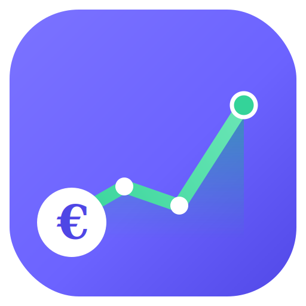

<p align="center">
  
</p>

<h1 align="center">Finance OS</h1>

<p align="center">
  A private, offline-first personal finance dashboard that runs entirely in your browser.<br>
  Sparkasse PDF import · budgets &amp; spending analysis · halal portfolio tracker · 3-phase wealth projections.<br>
  Installs as an app on iPhone, syncs to <strong>your own</strong> Google Drive.
</p>

---

## What this is

Finance OS is a **single-page web app** with **no backend**. Everything runs in your browser:

- **Your data never touches a server.** Transactions, balances, budgets and portfolio history live in your browser's **IndexedDB** and (optionally) a hidden folder in **your own Google Drive**. The published website is just code.
- **Sparkasse import** — drag in Stadtsparkasse München PDF statements; they're parsed locally (PDF.js + a pure-JS fallback). No upload.
- **Spending analysis** — budgets vs actuals, month-over-month trends, risk flags, a financial-health score.
- **Portfolio tracker** — log values over time, see contributions vs returns.
- **Projections** — an editable 3-phase savings/investing plan.
- **Integrations (optional)** — push a monthly summary to a Discord webhook, or mirror transactions to a Notion database. Credentials are entered in Settings and stored only on your device + your private Drive backup — **never in this repo**.
- **Installable PWA** — add to your iPhone home screen and use it like a native app, fully offline.

---

## ⚠️ Read this first: is my data safe in a public repo?

**Yes — because none of your data is in the repo.** This is the single most important thing to understand:

- The repository (and the published GitHub Pages site) contains **only application code**. There are **no transactions, balances, account numbers, tokens or webhooks** in it.
- When someone opens your site URL, they get an **empty app** running in *their* browser. Your data is in *your* browser's IndexedDB and *your* Google Drive (behind *your* Google login). They cannot see it.

### "Can I make the Pages site private / link-only instead?"

Short version: **not really, and you don't need to.**

- GitHub Pages sites are **served publicly on the internet**, even when the source repo is private. A "secret" URL is *obscurity, not security* — anyone with the link (or who guesses it) can load it.
- Serving Pages **from a private repo requires a paid plan** (GitHub Pro/Team), and even then the *site itself stays public*.
- **Actual access-controlled Pages** (visitors must log in to GitHub and be authorised) is a **GitHub Enterprise Cloud–only** feature.

Because the site is just code with zero embedded data, **public is the right and safe choice here.** Defence-in-depth for the *data* (which is the part that matters) is handled inside the app — see [SECURITY.md](SECURITY.md):

- Google sign-in uses the least-privilege **`drive.appdata`** scope — the app can only see its *own* hidden file, never the rest of your Drive.
- An optional **app PIN** gates the UI on your device.
- All secrets are entered at runtime and stored only locally + in your private Drive backup.

> If you ever fork/screenshot or paste an exported `financeOS_*.json` into the repo, **that** would leak data. The included `.gitignore` blocks those files and your `BankStatements/` folder by default. Keep it that way.

---

## 🚀 Deploy to GitHub Pages

1. **Create the repo.** On GitHub, create a public repository named **`finance-os`** under your account (`umairkhawaja`).
2. **Upload these files.** Either drag the whole folder into GitHub's web uploader, or:

   ```bash
   cd finance-os-pages
   git init
   git add .
   git commit -m "Finance OS — initial deploy"
   git branch -M main
   git remote add origin https://github.com/umairkhawaja/finance-os.git
   git push -u origin main
   ```

3. **Turn on Pages.** Repo → **Settings → Pages** → *Build and deployment* → **Deploy from a branch** → Branch **`main`**, folder **`/ (root)`** → **Save**.
4. Wait ~1 minute. Your app is live at:

   ```
   https://umairkhawaja.github.io/finance-os/
   ```

The repo already includes a `.nojekyll` file so GitHub serves all files as-is.

---

## 🔑 Google Drive sync setup (one-time, ~3 minutes)

Drive sync uses the OAuth **client ID** already wired into the app:

```
408463852317-ol63mj6hsbsvputlgod3e5nlr2o1b2s6.apps.googleusercontent.com
```

For Google to accept sign-in, you must register your site's URL on that client. In the [Google Cloud Console](https://console.cloud.google.com/apis/credentials), open the OAuth 2.0 Client (the one above) and add:

**Authorized JavaScript origins**

```
https://umairkhawaja.github.io
```

**Authorized redirect URIs** (must match *exactly*, including the trailing slash)

```
https://umairkhawaja.github.io/finance-os/
```

For local testing also add, as needed:

```
http://localhost:8000/        (origin: http://localhost:8000)
```

Then in the app: **Settings → Cloud Sync → Connect Google Drive**.

> **Why no popup?** Sign-in is a **full-page redirect** to Google and back — not a popup window. This is deliberate: popups are blocked or broken inside the iOS standalone (home-screen) web app and by some macOS browser settings. The redirect flow works reliably on macOS Safari/Chrome **and** the iPhone PWA. The access token is short-lived (~1 hour), kept only in your browser, and stripped from the URL the instant it returns.

### OAuth consent screen note

If the consent screen shows "unverified app", that's expected for a personal OAuth client. Add your own Google account as a **Test user** (OAuth consent screen → Test users) and you can use it indefinitely. You're only ever granting access to **this app's own hidden Drive folder**, nothing else.

---

## 📱 Install on iPhone

1. Open `https://umairkhawaja.github.io/finance-os/` in **Safari**.
2. Tap the **Share** icon → **Add to Home Screen**.
3. Launch it from the home screen — it runs full-screen, offline, with the app icon.
4. Connect Google Drive (Settings) so your data follows you across devices.

On macOS you can likewise install it via Chrome's "Install" button or Safari → *Add to Dock*.

---

## 🔄 How sync works

- A single state file, `financeos-state.json`, is stored in your Drive's hidden **appDataFolder**.
- **Auto-sync** (toggle in Settings, on by default) pushes changes ~4 s after you edit anything.
- **Pull / Push** buttons let you sync manually; the header **🔄 Sync** button does the same.
- On launch, the app **reconciles** local vs cloud by timestamp (newest wins). If it finds a cloud backup it can't match to this device, it asks you which copy to keep — so nothing is silently overwritten.
- **Daily backups**: once per day a timestamped copy (`financeos-backup-YYYY-MM-DD.json`) is saved; the last 15 are kept. Restore any of them from **Settings → Restore from a backup…**.
- You can always **Export / Import** a JSON snapshot manually (Settings) as an extra safety net.

---

## 🗂️ Repo structure

```
finance-os/
├── index.html              # the entire app (UI + logic + Drive sync + PIN lock)
├── manifest.webmanifest    # PWA metadata (name, icons, standalone display)
├── service-worker.js       # offline app-shell cache
├── .nojekyll               # tell GitHub Pages to serve files as-is
├── .gitignore              # blocks data snapshots, bank statements, secrets
├── LICENSE                 # MIT
├── README.md               # this file
├── SECURITY.md             # threat model + security details
└── assets/
    ├── logo.svg            # source logo (vector)
    ├── logo-maskable.svg
    ├── icon-192.png / icon-512.png
    ├── icon-192-maskable.png / icon-512-maskable.png
    ├── apple-touch-icon.png
    ├── favicon.ico / favicon-32.png
```

---

## 🛠️ Local development

It's a static site — any static server works:

```bash
cd finance-os-pages
python3 -m http.server 8000
# open http://localhost:8000
```

(Drive sign-in locally needs `http://localhost:8000/` added to the OAuth client as above. PDF parsing, PIN lock and all offline features work without it.)

---

## What changed vs the original artifact

- Removed the hardcoded Discord webhook and Notion database ID from the source (these are now runtime-only settings).
- Added Google Drive sync (redirect-based, popup-free), with auto-sync, manual push/pull, and daily versioned backups.
- Added an optional app PIN lock.
- Made it an installable, offline-capable PWA (manifest, service worker, Apple meta tags, safe-area insets for the iPhone notch).
- Added a real app logo and full icon set.
- Genericized the sample salary/plan defaults so no personal figures are baked into the public code (your real numbers live only in your data).

---

*Not affiliated with Stadtsparkasse München, Scalable Capital, Google, Discord or Notion. For personal use.*
